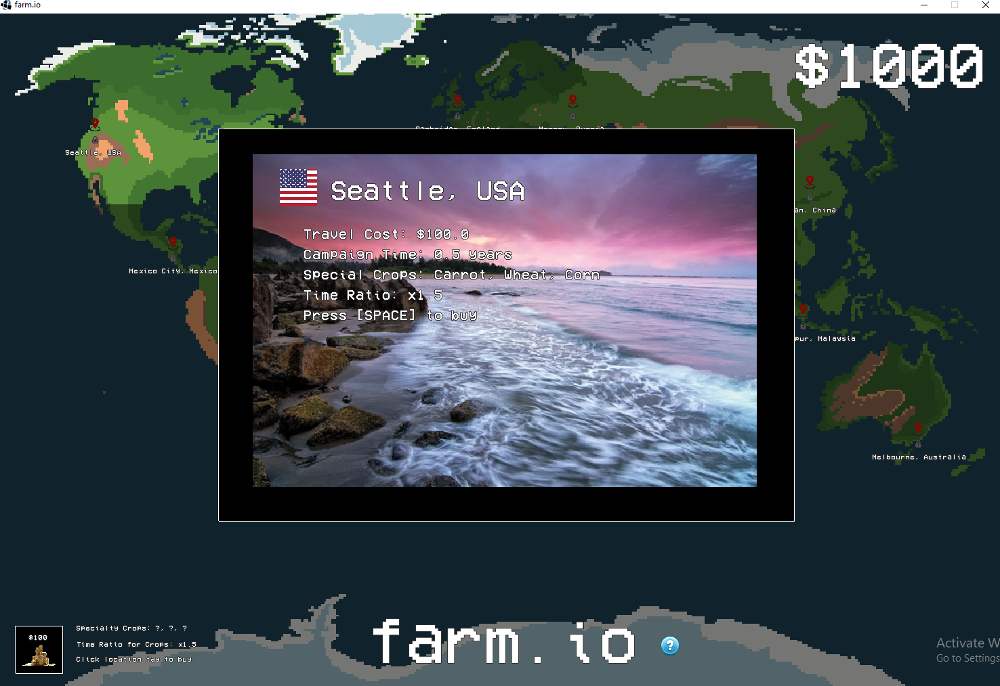
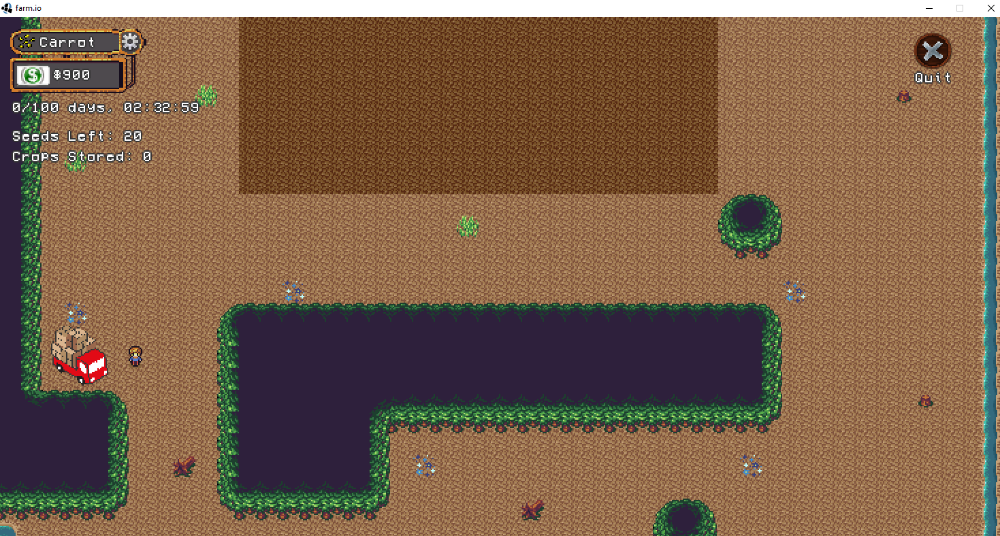

# farm.io
Created in LibGDX

Current features include working farming, a technology tree that the player can use to progressively upgrade their abilities, a main menu which can be used to travel to different locations in the world, each with custom features and "special crops" which can be purchased through time restricted campaigns

Working on Multiplayer Support
